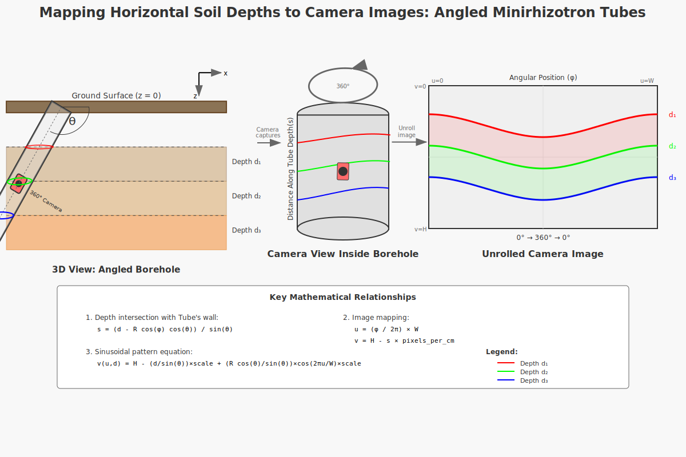

# Explaining the Math: Mapping Soil Depths on Minirhizotron Tube Images for Root Analysis

## The Big Picture: Why Soil Layers Look Wavy Inside a Minirhizotron Tube

For studying plant roots without disturbing them, researchers often install transparent tubes called **Minirhizotron tubes** into the soil at an angle. A special camera, like a **CID-602**, is inserted into the tube to take pictures of the roots growing against the tube's wall, visible through the transparent surface. The camera captures a 360° view at various points inside the tube. The software then "unrolls" this cylindrical picture into a flat, rectangular image, similar to how you'd flatten out a paper towel roll after cutting it open.

The challenge is that because the Minirhizotron tube is put into the ground at a slant (not straight down), the perfectly flat, horizontal soil layers in the ground won't appear as straight horizontal lines on the unrolled image. Instead, they will look like **wavy (sinusoidal) curves**.

This document explains the underlying geometry that creates these waves and provides the mathematical steps used by software to accurately draw lines on the unrolled image corresponding to specific horizontal soil depths.

### What We Have:

*   **Ground:** A flat surface (like the ground level, considered z=0), with soil layers stacked perfectly horizontally below it.
*   **Minirhizotron Tube:** A straight, transparent, right-circular tube with a constant radius R, inserted into the soil at a specific tilt angle (**θ**, measured **from the horizontal ground plane**).
*   **CID-602 Camera:** A camera designed to capture images of the inner wall of the tube (and the soil/roots visible through it).
*   **Unrolled Image:** A flat picture created by "unwrapping" the 360° cylindrical view captured by the camera.

### The Goal:

For plant biologists studying roots, it's crucial to know the exact depth of the roots they see in the image. The goal of this algorithm is to use geometry and math to draw accurate wavy lines on the unrolled image that show exactly where each original horizontal soil depth (like 10cm deep, 20cm deep) intersects the tube wall. This allows for precise root analysis by depth.

## Step 1: Where Are We Measuring From? Our Points of View

To locate anything precisely, we need a system for describing positions. We'll use three ways to describe where a point is:

1.  **Real-World Spot (x, y, z):** This is like giving directions in the actual physical space.
    *   We set our starting point (0,0,0) where the Minirhizotron tube enters the ground surface, at the center of the tube's top opening.
    *   x: Horizontal distance, in the direction the tube was inserted.
    *   y: Horizontal distance, sideways (perpendicular to the insertion direction).
    *   z: Vertical distance (**positive means up**, **negative means down into the soil** – so a depth `d` below the surface is at `z = -d`).
2.  **Tube Surface Spot (s, φ):** This describes a point based on its position *on the surface of the tube*.
    *   s: The distance measured along the *center line* of the tube, starting from where the tube enters the ground (s=0).
    *   φ (phi): The angular position measured *around* the tube (like 0° to 360°, or 0 to 2π radians). We define **φ=0** as the point on the tube's circumference that is **highest vertically** (most positive Z relative to the tube axis center) for a given 's'. φ increases as you wrap around (e.g., clockwise when looking down the tube). So φ=π (180°) is the point lowest vertically.
    *   The distance from the tube's center to the point is always the radius R because we are on the tube's wall.
3.  **Image Spot (u, v):** This describes where the point appears on the flat, unrolled picture from the camera.
    *   u: Horizontal position on the unrolled image (from the left edge, say u=0, to the right edge, u=W, the image width). This corresponds to the angle φ around the tube.
    *   v: Vertical position on the unrolled image (from the top edge, say v=0, to the bottom edge, v=H, the image height). This corresponds to the distance 's' along the tube axis. **Conventionally, larger 's' values (deeper along the core) often map to smaller 'v' values (higher up on the unrolled image).**

## Step 2: Tracing the Minirhizotron Tube's Center Line

Let's follow the path of the very center line of the Minirhizotron tube as it goes into the ground at angle θ from the horizontal plane.

Imagine a tiny dot moving along the very center of the tube. If it travels a distance 's' along the center line from where it entered the ground (our (0,0,0) start), where is it in the real world (x, y, z)?

*   The tube is tilted downwards at angle θ relative to the horizontal ground (the x-y plane).
*   As the dot moves 's' distance along this tilted line:
    *   Its horizontal movement in the insertion direction (x) is `s * cos(θ)`.
    *   Its vertical movement downwards corresponds to a change in the z-coordinate. Since Z is positive UP, the vertical position is `-s * sin(θ)`.
    *   It doesn't move sideways from the initial insertion plane (y = 0).

So, the real-world (x, y, z) position of the center of the Minirhizotron tube at distance 's' along its axis is:
**(s cos(θ), 0, -s sin(θ))**

## Step 3: Finding the Real-World Position of *Any* Point on the Tube Wall

Now, consider a point not just at the center, but *on the transparent wall* of the tube. To find its real-world (x, y, z) spot, we can start at the center point (from Step 2) and add a vector of length R that points outwards to the surface, corresponding to the angle φ around the tube. This outward vector needs to be translated into our x, y, and z coordinates, accounting for the tube's tilt.

The math shows that adding this outward movement vector to the center point's coordinates gives the following real-world (x, y, z) position for a point P on the tube surface at distance 's' along the axis and angular position 'φ':

**P(s,φ) = [s cos(θ) + R cos(φ) sin(θ), R sin(φ), -s sin(θ) + R cos(φ) cos(θ)]**

*   `(s cos(θ), 0, -s sin(θ))` is the real-world location of the tube's center at distance 's'.
*   `(R cos(φ) sin(θ), R sin(φ), R cos(φ) cos(θ))` are the components of the vector pointing from the center outwards to the surface point at angle φ, translated into the real-world x, y, and z directions.

**Critical Insight**: Look closely at the z-coordinate (vertical position) part: `-s sin(θ) + R cos(φ) cos(θ)`. The vertical position of a point on the tube wall depends on both how far along the tube you are ('s') *and* your angular position around the tube ('φ'). This interdependence is the key geometric reason why horizontal depth layers appear as wavy lines on the unrolled image!

## Step 4: Finding Where a Horizontal Soil Layer Intersects the Tube Wall

A horizontal soil layer at a specific depth 'd' is the collection of all points in the real world where the z-coordinate is equal to -d (since Z is positive UP and depth is positive DOWN). We want to find the points on the Minirhizotron tube wall that have this specific z-coordinate.

We take the z-coordinate part of our wall point formula from Step 3 and set it equal to -d:
`-s sin(θ) + R cos(φ) cos(θ) = -d`

Now, we solve this equation to find 's' (the distance along the tube axis) in terms of the depth 'd' and the angle 'φ' around the tube wall. This tells us, for a given depth and angle φ, how far down the tube axis (what 's' value) that horizontal soil layer appears.

Rearranging the equation to isolate 's':

`s sin(θ) = d + R cos(φ) cos(θ)`

`s = (d + R cos(φ) cos(θ)) / sin(θ)`

**Big Aha Moment (Corrected):** Look at this formula for 's'. For a fixed depth 'd', the value of 's' is *not* constant. It changes depending on `cos(φ)`. This is the fundamental discovery that explains the wavy pattern!

### What This Means Physically (Corrected):

*   Remember φ=0 is the "top" of the tube circumference (highest Z relative to axis) and φ=π is the "bottom" (lowest Z relative to axis).
*   `s` is largest when `cos(φ)` is largest (when `φ=0`, `cos(0)=1`). This means the line of constant depth `d` intersects the tube at the **largest** 's' value (furthest down the tube axis) at the **top** (`φ=0`) of the tube's circumference.
*   `s` is smallest when `cos(φ)` is smallest (when `φ=π`, `cos(π)=-1`). This means the depth line intersects the tube at the **smallest** 's' value (closest to the ground entry, potentially even a negative 's' if the depth is very shallow) at the **bottom** (`φ=π`) of the tube's circumference.
*   As you move around the tube wall (change φ from 0 to 2π), the distance 's' at which a horizontal depth layer intersects the wall varies following a cosine curve.

This makes sense geometrically: because the tube is tilted, the "top" of the tube's inner surface is always further *down* the overall slope into the ground than the "bottom" of the tube's inner surface, when measured from the horizontal ground surface. Therefore, the top surface reaches a given horizontal depth later (at a larger 's' value) than the bottom surface does.

## Step 5: Translating Tube Positions to Image Positions

The CID-602 camera software "unrolls" the cylindrical view into a flat, rectangular image. This transformation maps positions on the tube surface (described by s and φ) to pixel locations on the image (described by u and v).

*   **Angle around the tube (φ) maps to Horizontal position on the image (u):** Going all the way around the tube (0 to 2π radians) corresponds to going all the way across the unrolled image (from u=0 to u=W, the image width). Assuming a linear mapping, the angle φ is proportional to the horizontal pixel position 'u':
    `φ = (u / W) × 2π` (if u=0 maps to φ=0)

*   **Distance along the tube (s) maps to Vertical position on the image (v):** The distance 's' measured along the tube's axis corresponds directly to the vertical position 'v' on the unrolled image. Imagine cutting the tube and flattening it – lines parallel to the tube's axis become vertical lines on the image. The distance along these lines is 's'. The exact mapping depends on the camera's vertical calibration (`pixels_per_cm_s`) and the image's coordinate system (where v=0 is).
    A common mapping is:
    `v = V_offset - (s × pixels_per_cm_s)`
    Here, `V_offset` is a reference vertical position (e.g., the vertical pixel corresponding to s=0), and `pixels_per_cm_s` is the conversion factor from real-world distance 's' (in cm) to image pixels. The `- (s × ...)` part means that larger values of 's' (further down the tube into the ground) correspond to smaller values of 'v' (higher up on the image, assuming v=0 is the top, which is a typical image convention).

## Step 6: Putting It All Together - The Final Formula for Drawing Depth Lines

We want a formula that tells us, for any horizontal pixel column 'u' on the unrolled image, what vertical pixel row 'v' corresponds to a specific horizontal soil depth 'd'.

We combine the relationships found in previous steps:
1.  `v` is a function of `s` (`v = V_offset - s × pixels_per_cm_s`)
2.  `s` is a function of `d` and `φ` (`s = (d + R cos(φ) cos(θ)) / sin(θ)`)
3.  `φ` is a function of `u` (`φ = (u / W) × 2π`)

Substitute the expression for `φ` into the formula for `s`:
`s(u,d) = (d + R cos( (u / W) × 2π ) cos(θ)) / sin(θ)`

Then substitute this expression for `s` into the formula for `v`:

`v(u,d) = V_offset - [ (d + R cos( (u / W) × 2π ) cos(θ)) / sin(θ) ] × pixels_per_cm_s`

This is the core formula the software uses! For every horizontal position `u` across the image, it calculates the corresponding `v` to draw the point for depth `d`. Connecting these points creates the wavy depth line.

We can rewrite this formula to see the components more clearly:

`v(u,d) = [V_offset - (d / sin(θ)) × pixels_per_cm_s] - [(R cos(θ) / sin(θ)) × cos(2πu/W) × pixels_per_cm_s]`

`v(u,d) = [V_offset - (d / sin(θ)) × pixels_per_cm_s] - [R cot(θ) × cos(2πu/W) × pixels_per_cm_s]`

### Understanding the Final Formula's Meaning:

*   **Part 1: The Average Line Position** `[V_offset - (d / sin(θ)) × pixels_per_cm_s]`
    *   This part is a constant value for a given depth `d` and tube angle `θ` (and calibration `pixels_per_cm_s`). It determines the overall average vertical level of the depth line on the image.
    *   Deeper soil layers (larger `d`) result in a larger value subtracted from `V_offset`, meaning a smaller `v` value. This confirms that deeper layers are drawn higher up on the image (assuming v=0 is the top).
*   **Part 2: The Sinusoidal (Wavy) Pattern** `-[R cot(θ) × cos(2πu/W) × pixels_per_cm_s]`
    *   This part creates the characteristic wave shape. It changes as you move across the image (as 'u' changes) because of the `cos(2πu/W)` term.
    *   The term `cos(2πu/W)` goes through exactly one full wave cycle (from 1 to -1 and back to 1) as 'u' goes from the left edge (0) to the right edge (W) of the image. This corresponds to going once around the tube (0 to 2π in φ, assuming u=0 maps to φ=0).
    *   The number `R cot(θ)` is the **amplitude of the variation in 's'** along the tube axis for a fixed depth. Multiplied by `pixels_per_cm_s`, it becomes the **amplitude of the wave in pixels** on the image.
        *   It depends on the tube's radius R: A wider Minirhizotron tube leads to taller waves on the image.
        *   It depends significantly on the tilt angle θ (via the cotangent):
            *   If θ is close to 90° (tube nearly vertical), `cot(θ)` is small, and the amplitude is small. The wave flattens out, and the depth line becomes nearly horizontal – which makes perfect sense for a vertical tube!
            *   If θ is small (tube nearly horizontal), `cot(θ)` is large, leading to very large amplitude waves.

    *   The negative sign in front of the second term (`- [R cot(θ) ... ]`) means that where `cos(2πu/W)` is maximum (i.e., at u=0 and u=W, which map to φ=0, the top of the tube), a large positive value is *subtracted* from the average `v`. This results in the *smallest* `v` value (highest point on the image) at the horizontal edges corresponding to the top of the tube circumference. This matches the physical reality: the top of the tube reaches deeper 's' values, and deeper 's' values map to higher 'v' pixels.

## Step 7: Practical Implementation - Using the Math for Root Analysis

The algorithm doesn't just draw lines; it allows researchers to use these lines to identify and analyze roots at specific depths.

By calculating the curve points for each desired depth line using the formula `v(u,d)`, the software can:
*   Visually show the user exactly where different depth levels (e.g., 0-10cm, 10-20cm) cross the image.
*   Mathematically define the image region *between* two consecutive depth lines as a specific soil layer. This allows for automated or manual analysis (like counting or measuring roots) strictly within that depth range.

This often involves generating a mask or polygon on the image that outlines the area between the calculated upper and lower depth curves for a given layer.

## Angle Convention

As defined earlier and used consistently in the formulas, θ is the angle measured between the **horizontal plane** and the cylinder core axis, representing the downward tilt.

## Validation and What the Formulas Need

The math behind this algorithm is based on the exact geometry of a tilted cylinder intersecting a flat plane. The formulas are accurate provided:
1.  The Minirhizotron tube is inserted at an angle other than perfectly horizontal (`0° < θ < 180°`, specifically where `sin(θ) ≠ 0`). The formula involves division by `sin(θ)`, which is zero at 0° and 180°, requiring special handling for purely horizontal insertion. For typical minirhizotron use, the angle is between 0° and 90°.
2.  We are interested in actual depths below the surface. The formula for `s` can produce negative values for very shallow depths or points high up on the circumference if applied near the ground surface (d=0). This correctly represents points on the tube surface that are technically "above" the s=0 entry point relative to the tube axis.
3.  We are considering points along the tube that are physically within the imaged section and inserted into the ground.

## Summary and Key Takeaways

1.  **The Problem**: Horizontal soil layers look wavy on flat images from tilted Minirhizotron tubes because of the 3D geometry.
2.  **The Cause**: A horizontal plane (soil layer at depth `d`) intersects a tilted cylinder (Minirhizotron tube) such that the points of intersection are at different distances along the cylinder axis (`s`) depending on the angle around the cylinder (`φ`). This variation in 's' is sinusoidal with respect to 'φ': `s = (d + R cos(φ) cos(θ)) / sin(θ)`.
3.  **The Solution**: Use trigonometry and coordinate transformations to derive a formula (`v(u,d)`) that maps a horizontal pixel position (`u`) and a desired real-world depth (`d`) to the correct vertical pixel position (`v`) on the unrolled image, by first calculating the corresponding 's' value.
4.  **The Result**: Accurate depth lines that are precise sinusoidal waves whose shape and position are determined by the tube's radius, the insertion angle, and the depth. The amplitude of the variation in 's' is `R cot(θ)`, which translates to the pixel amplitude of the wave on the image.

By understanding and implementing this geometry, Minirhizotron camera systems like the CID-602 and their analysis software can accurately provide depth-specific information on the unrolled images, allowing plant biologists to precisely study root development within different soil layers. The wavy pattern isn't a distortion; it's the correct geometric representation of horizontal depths seen from the perspective of a tilted tube wall.
